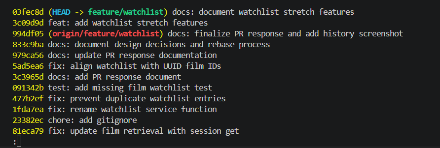

# PR Response Doc — CineLog Watchlist Feature

## AI Usage

I used AI tools to help orient myself within the existing codebase, understand the service and test patterns, and reason through the review feedback. I provided the relevant code to the AI tool and used its explanations to compare the watchlist implementation with patterns in the existing collection feature.

For Comments 4 and 5, I also used AI to stress-test my reasoning by considering counterarguments and tradeoffs. For Comment 4, I considered the privacy tradeoff of public-by-default watchlists. For Comment 5, I considered the discoverability benefit of alphabetical ordering before choosing newest-added-first. I verified the suggestions against the CineLog codebase and project requirements, made the final design decisions based on the application context, and ran the full test suite after implementation and rebasing.

## Comment 1 — Rename

**What I did:** Renamed `save_to_watchlist()` to `add_to_watchlist()` and updated all imports and call sites.

**How I verified:** I searched the codebase to confirm that no references to `save_to_watchlist()` remained. I also ran the full test suite successfully.

## Comment 2 — Deduplication

**What I did:** Added a duplicate check to `add_to_watchlist()` and introduced `AlreadyInWatchlistError`. Before creating a new `WatchlistEntry`, the service checks for an existing entry with the same `user_id` and `film_id`.

**How I verified:** I added a test that attempts to add the same film twice, verifies that `AlreadyInWatchlistError` is raised, and confirms that only one watchlist entry remains in the database.

## Comment 3 — Missing Test

**What I did:** Added a test verifying that `add_to_watchlist()` raises `FilmNotFoundError` when the requested `film_id` does not exist.

**How I verified:** I followed the existing test pattern in `test_collection.py` and used `pytest.raises()` to verify the expected exception. I ran the full test suite and confirmed that all tests pass.

## Comment 4 — Default Visibility

**My position:** I decided to keep `public=True` as the default visibility for watchlist entries.

**Reasoning:** CineLog is a community film-tracking application, so public watchlists support the application's social and discovery-oriented purpose by making film interests shareable by default. This choice optimizes for users who want to discover films through other users' watchlists and share their own film interests with the community.

**Tradeoff acknowledged:** I recognize the privacy tradeoff. Some users may prefer their saved films to remain private by default and may not expect their watchlist activity to be publicly visible. To address this tradeoff, I later implemented the optional visibility-toggle stretch feature so callers can explicitly create private entries by passing `public=False`. The default remains `public=True` to preserve the existing behavior and support CineLog's community-oriented purpose.

## Comment 5 — Sort Order

**My position:** I chose to implement the maintainer's preference and order watchlist entries by date added, with the newest entries first.

**Reasoning:** The maintainer pointed out that users are more likely to return to recently added films than to search their watchlists alphabetically. I agree with this reasoning because a watchlist represents films a user intends to watch, so recently saved films are likely to reflect the user's current interests. Ordering by newest-added-first also makes `get_watchlist()` consistent with the existing `get_collection()` behavior, which orders entries by `date_added` in descending order.

**Engagement with reviewer's point:** Alphabetical ordering can make a specific film easier to locate in a large watchlist, but it gives less priority to the user's recent activity. For CineLog's current behavior, I chose newest-added-first because it better supports returning to recently discovered films and maintains consistency between the collection and watchlist services.

## Comment 6 — Rebase and UUID Migration

**What conflicted:** During the rebase onto the updated `main` branch, Git reported an add/add conflict in `.gitignore`. The updated `main` branch also contained a data-model change in which `Film.id` had been migrated from integer IDs to UUID-compatible strings while the watchlist implementation still referenced the earlier film ID type.

**How I resolved it:** I resolved the `.gitignore` conflict and continued the rebase. I then updated `WatchlistEntry.film_id` to use `db.String(36)` so that it matched the UUID-compatible `Film.id` type. I also updated the related watchlist service code and documentation to reflect the UUID-based film IDs while preserving the existing watchlist feature behavior.

**How I verified no conflict remains:** I completed the rebase successfully and ran the full test suite with `pytest tests/ -v`. After completing the required changes and stretch features, all nine tests passed. I also confirmed that the working tree was clean and inspected the final Git history to verify that the feature branch was rebased onto `main` without merge commits.

## PR Description

This PR completes the CineLog watchlist feature, addresses all six review comments, and implements three stretch features. The implementation renames the watchlist service function to follow the existing naming convention, prevents duplicate watchlist entries, adds tests for duplicate and nonexistent film cases, documents the default visibility decision, changes the default sort order to newest-added-first, and aligns the watchlist model with the UUID-based film IDs introduced on `main`.

The stretch features add `remove_from_watchlist()` functionality, an additional edge-case test for attempts to remove films that are not in a user's watchlist, and a visibility toggle that allows callers to explicitly create public or private watchlist entries.

### Design Decisions

The watchlist retains `public=True` as its default visibility because CineLog is designed as a community film-tracking application. This supports social discovery while acknowledging that some users may prefer private watchlist entries. The optional visibility parameter allows callers to explicitly pass `public=False` when creating an entry while preserving the existing public default.

Watchlist entries are sorted by `date_added` in descending order. This prioritizes recently saved films and keeps the watchlist behavior consistent with the existing collection service.

### Manual Testing Steps

1. Install the project dependencies and activate the virtual environment.
2. Run `pytest tests/ -v`.
3. Confirm that all nine tests pass.
4. Verify that adding a valid film creates a watchlist entry.
5. Verify that adding the same film twice raises `AlreadyInWatchlistError`.
6. Verify that adding a nonexistent film raises `FilmNotFoundError`.
7. Verify that `get_watchlist()` returns entries with the newest-added films first.
8. Verify that `remove_from_watchlist()` removes an existing watchlist entry.
9. Verify that removing a film that is not in the watchlist raises `NotInWatchlistError`.
10. Verify that calling `add_to_watchlist()` with `public=False` creates a private watchlist entry.

### Final Commit History

The final `feature/watchlist` branch history contains separate conventional commits for the watchlist feature, review fixes, tests, UUID alignment, documentation, and stretch features, with no merge commits.

## Stretch Feature — Remove from Watchlist

**What I did:** Implemented `remove_from_watchlist(user_id, film_id)` in the watchlist service. The function searches for the matching watchlist entry, removes it from the database, and commits the change. I also added `NotInWatchlistError` to handle attempts to remove a film that is not present in the user's watchlist.

**How I verified:** I added `test_remove_from_watchlist_removes_entry()`, which first adds a film to the user's watchlist, removes it using `remove_from_watchlist()`, and verifies that no matching `WatchlistEntry` remains in the database. I ran the full test suite with `pytest tests/ -v` and confirmed that all nine tests pass.

## Stretch Feature — Additional Edge-Case Test

**What I did:** Added an additional test verifying that `remove_from_watchlist()` raises `NotInWatchlistError` when a user attempts to remove a film that is not currently in the watchlist.

**Why I chose this edge case:** The successful removal test verifies the normal behavior of `remove_from_watchlist()`, but it does not verify how the service handles an invalid removal request. I chose this edge case to confirm that the service fails predictably instead of silently succeeding when no matching watchlist entry exists.

**How I verified:** I added `test_remove_from_watchlist_nonexistent_entry_raises()` and used `pytest.raises(NotInWatchlistError)` to verify the expected behavior. The full test suite passes.

## Stretch Feature — Visibility Toggle

**What I did:** Added a `public` parameter to `add_to_watchlist()` so callers can explicitly control whether a new watchlist entry is publicly visible. The parameter defaults to `True` to preserve the existing behavior.

**Why I made this change:** The visibility toggle gives users more control over their watchlist entries instead of requiring every entry to use the default visibility. Keeping `public=True` as the default maintains backward compatibility while allowing callers to create private entries by passing `public=False`.

**How I verified:** I added `test_add_to_watchlist_sets_visibility()`, which creates a watchlist entry with `public=False` and verifies that the stored entry is private. I also ran the full test suite with `pytest tests/ -v` and confirmed that all nine tests pass.